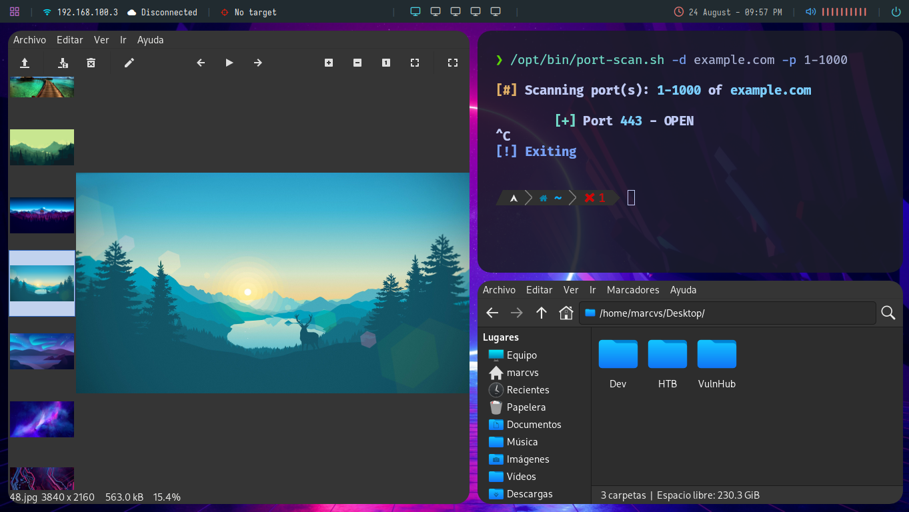
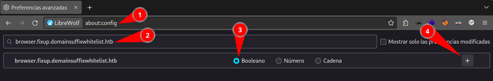

# Configuración general

## Creditos

Este entorno está inspirado en el de **s4vitar** y está hecho especificamente para **Kali Linux**, sin embargo, se mezclan configuraciones de sus 2 últimos vídeos de configuración de entornos para linux en YT:

- [Entorno Parrot de s4vitar](https://www.youtube.com/watch?v=mHLwfI1nHHY).
- [Entorno Arch de s4vitar](https://www.youtube.com/watch?v=fshLf6u8B-w).

Así com los temas de la polybar de [adi1090x](https://github.com/adi1090x/polybar-themes). Y nuevas cosas hechas por mí.



- [Configuración general](#configuración-general)
  - [Creditos](#creditos)
  - [Instalaciones](#instalaciones)
    - [Software del sistema](#software-del-sistema)
    - [Software que no estan en APT](#software-que-no-estan-en-apt)
    - [Instalación por repositorios](#instalación-por-repositorios)
    - [Fuentes](#fuentes)
  - [Configuraciones](#configuraciones)
  - [Opcional](#opcional)
    - [Atajos de aplicaciones](#atajos-de-aplicaciones)
    - [TLD o dominio raíz personalizado en navegador web](#tld-o-dominio-raíz-personalizado-en-navegador-web)
    - [Doble monitor](#doble-monitor)
    - [Cambiar prompt](#cambiar-prompt)
    - [Configurar lightdm](#configurar-lightdm)
    - [Nevagador por default](#nevagador-por-default)
  - [Errores y soluciones](#errores-y-soluciones)

Para un entorno más básico consultar la información [Extras](Extras.md).

## Instalaciones

### Software del sistema

No instalados en Kali por defecto

```bash
sudo update -y
sudo apt install -y bat cmake dnsutils docker-compose docker.io gettext gettext-doc gettext-el gobuster htop html2text httpie jq lsd moreutils ncat p7zip p7zip-full p7zip-rar ranger rlwrap suckless-tools tor torbrowser-launcher xclip xterm
```

Entorno de trabajo

```bash
sudo update -y
sudo apt install -y alsa-utils betterlockscreen brightnessctl bspwm cbatticon command-not-found feh flameshot imagemagick pavucontrol polybar rofi sxhkd volumeicon-alsa zsh zsh-autosuggestions zsh-syntax-highlighting
```

Ya instaladas pero utiles

```bash
sudo update -y
sudo apt install -y curl ffuf gcc gettext-base git gzip iptables macchanger make nano net-tools netdiscover netmask nmap openssl openvpn plocate proxychains python-is-python3 python2 python3 python3-pip tcpdump tree ufw unzip vim wget whatweb zip
```

Herramientas de pentest muy grandes

```bash
sudo update -y
sudo apt install -y burpsuite metasploit-framework wireshark zaproxy
```

Extras

```bash
sudo apt install -y libreoffice libreoffice-l10n-es libreoffice-help-es
```

### Software que no estan en APT

Instalación manual

- [starship](https://starship.rs/es-ES/guide/#%F0%9F%9A%80-instalacion)
- [python2-pip](Extras.md#descargar-pip2)
- [neovim (latest)](https://github.com/neovim/neovim-releases/releases)

Instalar picom (mejor opción que con APT)

```bash
sudo apt update -y
sudo apt install -y meson libxext-dev libxcb1-dev libxcb-damage0-dev libxcb-xfixes0-dev libxcb-shape0-dev libxcb-render-util0-dev libxcb-render0-dev libxcb-randr0-dev libxcb-composite0-dev libxcb-image0-dev libxcb-present-dev libxcb-xinerama0-dev libpixman-1-dev libdbus-1-dev libconfig-dev libgl1-mesa-dev libpcre2-dev libevdev-dev uthash-dev libev-dev libx11-xcb-dev libxcb-glx0-dev libpcre3-dev libev4

cd ~/Templates
git clone https://github.com/ibhagwan/picom.git
cd picom/
git submodule update --init --recursive
meson --buildtype=release . build
ninja -C build
sudo ninja -C build install
```

Si existen errores o no funciona la **Polybar** consultar la sección [Polybar](Errores.md#polybar) de los errores.

### Instalación por repositorios

En el caso de `librewolf` seguir mi tutorial de mi [página web](https://marcvspt.github.io/posts/instalar-librewolf-parrot-derivados-debian/):

```bash
sudo apt update -y && sudo apt install -y wget gnupg lsb-release apt-transport-https ca-certificates

wget -O- https://deb.librewolf.net/keyring.gpg | sudo gpg --dearmor -o /usr/share/keyrings/librewolf.gpg

sudo tee /etc/apt/sources.list.d/librewolf.sources << EOF > /dev/null
Types: deb
URIs: https://deb.librewolf.net
Suites: bullseye
Components: main
Architectures: amd64
Signed-By: /usr/share/keyrings/librewolf.gpg
EOF

sudo apt update -y
sudo apt install -y librewolf
```

En el caso de `visual studio code`, podemos usar el **.deb** directamente para instalarlo y automaticamente se instalará el repositorio para futuras actualizaciones:

```bash
sudo apt install -y wget gpg

wget -qO- https://packages.microsoft.com/keys/microsoft.asc | gpg --dearmor > packages.microsoft.gpg
sudo install -D -o root -g root -m 644 packages.microsoft.gpg /etc/apt/keyrings/packages.microsoft.gpg
sudo sh -c 'echo "deb [arch=amd64,arm64,armhf signed-by=/etc/apt/keyrings/packages.microsoft.gpg] https://packages.microsoft.com/repos/code stable main" > /etc/apt/sources.list.d/vscode.list'
rm -f packages.microsoft.gpg

sudo apt update -y
sudo apt install -y code
```

Instalar `microsoft edge`:

```bash
sudo apt update -y

curl https://packages.microsoft.com/keys/microsoft.asc | gpg --dearmor > microsoft.gpg
sudo install -o root -g root -m 644 microsoft.gpg /usr/share/keyrings/
sudo sh -c 'echo "deb [arch=amd64 signed-by=/usr/share/keyrings/microsoft.gpg] https://packages.microsoft.com/repos/edge stable main" > /etc/apt/sources.list.d/microsoft-edge.list'
sudo rm microsoft.gpg

sudo apt update -y
sudo apt install -y microsoft-edge-stable
```

Instalar `spotify`:

```bash
sudo apt update -y
sudo apt install -y dirmngr

curl -sS https://download.spotify.com/debian/pubkey_7A3A762FAFD4A51F.gpg | sudo gpg --dearmor --yes -o /etc/apt/trusted.gpg.d/spotify.gpg
echo "deb http://repository.spotify.com stable non-free" | sudo tee /etc/apt/sources.list.d/spotify.list

sudo apt update -y
sudo apt install -y spotify-client
```

### Fuentes

Se necesitan las siguientes fuentes de [nerd fonts](https://github.com/ryanoasis/nerd-fonts/releases):

- FiraCode
- FantasqueSansMono
- Iosevka

Se necesita también la siguiente fuente para emojis:

- [Noto Emoji](https://fonts.google.com/noto/specimen/Noto+Emoji)

## Configuraciones

Copiar archivos de configuraciones:

```bash
user=$(whoami)
sudo chown $user:$user /opt
chmod 755 /home/$user

cp ./home/bashrc ~/.bashrc
cp ./home/zshrc ~/.zshrc
cp ./home/p10k.zsh ~/.p10k.zsh
cp ./home/nanorc ~/.nanorc
cp ./home/vimrc ~/.vimrc
cp ./home/Xdefaults ~/.Xdefaults
cp -r ./config/htop /home/$user/.config/htop
cp -r ./config/bspwm /home/$user/.config/bspwm
cp -r ./config/sxhkd /home/$user/.config/sxhkd
cp -r ./config/picom /home/$user/.config/picom
cp -r ./config/polybar /home/$user/.config/polybar
cp -r ./config/starship.toml /home/$user/.config/starship.toml
cp -r ./opt/* /opt/
```

Configuraciones apartir de repositorios:

- [**powerlevel10k**](https://github.com/romkatv/powerlevel10k#manual).
- [**fzf**](https://github.com/junegunn/fzf#using-git)
- [**NvChad**](https://nvchad.com/docs/quickstart/install)
- [**ZSH sudo plugin**](https://raw.githubusercontent.com/ohmyzsh/ohmyzsh/master/plugins/sudo/sudo.plugin.zsh)
- [**ZSH git plugin**](https://raw.githubusercontent.com/ohmyzsh/ohmyzsh/master/plugins/git/git.plugin.zsh)

Haremos links simbólicos a estos archivos para root, de esta forma no necesitaremos instalar de nuevo estas herramientas, temas y configuraciones para root:

```bash
user=$(whoami)
sudo mkdir -p /root/.local/share/ 2>/dev/null
sudo mkdir -p /root/.local/state/ 2>/dev/null

sudo ln -s -f /home/$user/.bashrc /root/.bashrc
sudo ln -s -f /home/$user/.zshrc /root/.zshrc
sudo ln -s -f /home/$user/.p10k.zsh /root/.p10k.zsh
sudo ln -s -f /home/$user/.nanorc /root/.nanorc
sudo ln -s -f /home/$user/.vimrc /root/.vimrc
sudo ln -s -f /home/$user/.Xdefaults /root/.Xdefaults
sudo ln -s -f /home/$user/.config/htop/ /root/.config/
sudo ln -s -f /home/$user/.config/starship.toml /root/.config/starship.toml
sudo ln -s -f /home/$user/.config/nvim /root/.config/
sudo ln -s -f /home/$user/.local/share/nvim /root/.local/share/
sudo ln -s -f /home/$user/.local/state/nvim /root/.local/state/
sudo ln -s -f /home/$user/powerlevel10k /root/
sudo ln -s -f /home/$user/.fzf /root/
sudo ln -s -f /home/$user/.fzf.zsh /root/
sudo ln -s -f /home/$user/.fzf.bash /root/
```

Configurar el background del escritorio y de la pantalla de bloqueo:

```bash
user=$(whoami)
mkdir -p /home/$user/Imágenes

git clone https://github.com/marcvspt/Wallpapers.git ~/Imágenes/Wallpapers
betterlockscreen -u /home/$user/Imágenes/Wallpapers/24.jpg # Elige el que más te guste
```

## Opcional

### Atajos de aplicaciones

Se pueden modificar los atajos de teclado del entorno en el archivo [sxhkdrc](config/sxhkd/sxhkdrc). Es importante probar la configuración y al recargar el entorno ejecutar `Super + Esc`.

### TLD o dominio raíz personalizado en navegador web

**Nota:** *SOLO FUNCIONA EN NAVEGADORES BASADOS EN FIREFOX: firefox, waterfox, librewolf, etc.*

Es posible configurar **TLDs** personalizados en nuestro navegador para que se resuelvan normalmente sin tomarlo como una *query* de busqueda en la web. Debemos añadir una regla booleana como *True* en `about:config` de la *URL*, por ejemplo:

```url
browser.fixup.domainsuffixwhitelist.htb
```

`.htb` es el dominio raíz como `.com`, `.io`, `.org`, etc., ahora podemos poner `searcher.htb`, `lolipop.htb`, etc., y nos dirigirá al dominio personalizado.



### Doble monitor

Este repositorio ya tiene un script y configuraciones para que **BSPWM** funcione con doble monitor extendido a la derecha. Necesitamos descomentar el bloque if del archivo [bspwmrc](config/bspwm/bspwmrc):

```bash
my_laptop_external_monitor=$(xrandr --query | grep 'HDMI-1')
if [[ $my_laptop_external_monitor != *disconnected* ]]; then
  bspc monitor eDP-1 -d I II III IV V
  bspc monitor HDMI-1 -d VI VII VIII IX X
else
  bspc monitor -d I II III IV V VI VII VIII IX X
fi
```

Guardamos cambios y ejecutamos las teclas `Super + Shift + R` y `Super + Esc`. Si existen errores o no funciona consultar la sección de [Bspwm doble monitor](Errores.md#bspwm-doble-monitor) de los errores.

### Cambiar prompt

Si quieres usar `starship` en vez de `powerlevel10k` comenta estas lineas en [**ZSHRC**](home/.zshrc):

```zsh
#source ~/powerlevel10k/powerlevel10k.zsh-theme

# To customize prompt, run `p10k configure` or edit ~/.p10k.zsh.
#[[ ! -f ~/.p10k.zsh ]] || source ~/.p10k.zsh
```

Y descomenta esta linea:

```zsh
eval "$(starship init zsh)"
```

Podemos cambiar el prompt para colorearlo al estilo **Arch**, **Fedora** y **Generic**, es decir, colores personalizados. Debemos descomentar y comentar las secciones correspondientes a los prompts que queremos usar en el [bashrc](home/bashrc). Si quieres usar `starship`, solo descomenta esta linea en el mismo archivo `bashrc`:

```bash
eval "$(starship init bash)"
```

### Configurar lightdm

```bash
cp ./etc/lightdm* /etc/lightdm/
```

### Nevagador por default

Para establecer el navegador web por default hacemos lo siguiente:

```bash
sudo update-alternatives --install /usr/bin/x-www-browser x-www-browser /usr/bin/librewolf 100
sudo update-alternatives --config x-www-browser
##### Select librewolf
```

Buscar el binario en las rutas `bin` como:

- `/bin`
- `/usr/bin`
- `/usr/local/bin`
- `/sbin`
- `/usr/sbin`
- `/usr/local/sbin`

## Errores y soluciones

[Errores.md](Errores.md)
